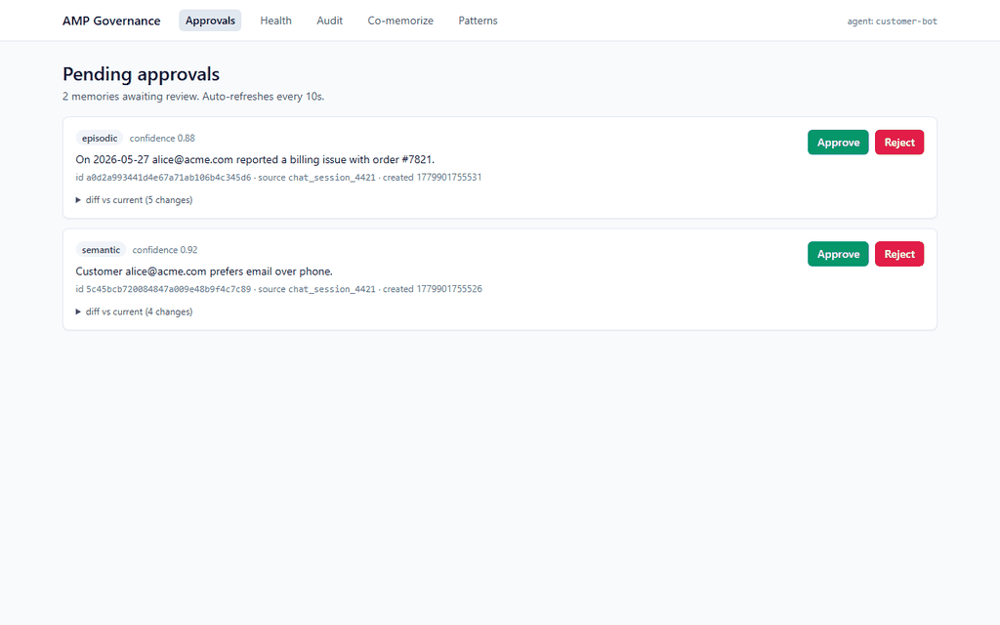
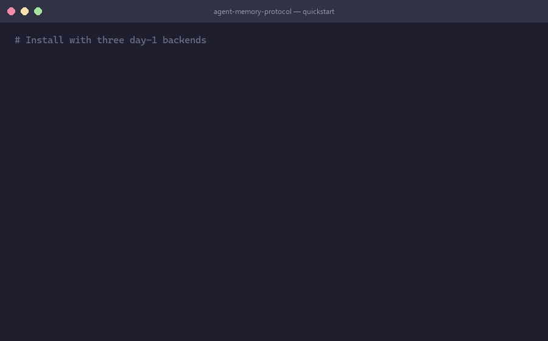

<h1 align="center">memorywire</h1>

<p align="center">
  <strong>A vendor-neutral wire format for agent memory operations.</strong>
</p>

<p align="center">
  <a href="https://github.com/mthamil107/memorywire/actions/workflows/ci.yml"></a>
  <a href="LICENSE"></a>
  <a href="https://www.python.org"></a>
  
  
  
</p>

<p align="center">
  <a href="docs/spec/v0.md">Read the spec</a>
  &nbsp;&middot;&nbsp;
  <a href="docs/MCP-RELATIONSHIP.md">How memorywire relates to MCP</a>
  &nbsp;&middot;&nbsp;
  <a href="SECURITY.md">Security</a>
</p>

---

<p align="center">
  
</p>

> **Everyone else built a memory _store_. memorywire is the vendor-neutral protocol and governance layer that sits _above_ all of them.**

## Positioning

Memory _storage_ for AI agents is saturated &mdash; mem0, Letta, Cognee, Zep, and a dozen others each ship their own format, their own database, and their own lock-in. memorywire is not another store. It's the thin, stable layer above them: one wire format so any agent can talk to any backend, carry its memory across runtimes, and let a human review and approve what gets remembered before it's committed.

If you already run mem0, Letta, or Cognee, keep them. memorywire gives you a single interface across all of them, plus a governance plane to audit what they remember.

## Why memorywire is different

memorywire's edge is **position**, not feature count. Four things set it apart from the rest of the agent-memory ecosystem.

**1. It's an interop layer, not a silo.** memorywire defines five operations (`remember`, `recall`, `forget`, `merge`, `expire`) as a stable JSON-Schema wire format, and routes them across pluggable backends &mdash; sqlite-vec, mem0, Letta, Cognee, and pgvector on day one. Every other project asks you to adopt _its_ store and _its_ format. memorywire lets you keep what you have and talk to all of it through one surface.

**2. Governance is built in.** When `approval_required` is set on a write, a `remember` call _stages_ instead of commits. The governance UI shows a structured diff against current state; a reviewer approves or rejects; the decision is audit-logged. Controlling and auditing what an agent is allowed to remember is a production need that the major open-source memory frameworks don't ship today &mdash; this is where memorywire earns its keep.

**3. Routers compose.** The memory router itself implements the `MemoryStore` protocol, so a router can be a backend for another router. Fan-out, fusion, and graph-boost all nest cleanly &mdash; an architectural property most memory systems don't have.

**4. Procedural memory is first-class.** Agent how-to is stored as serializable `transitions` state machines you can replay and inspect &mdash; not flattened into text or vectors. memorywire treats `semantic`, `episodic`, `procedural`, and `emotional` as distinct, spec-defined types rather than one undifferentiated blob.

### What memorywire does _not_ claim to invent

In the interest of an honest pitch: STM&harr;LTM consolidation and tiering are shared with systems like MemOS; RRF is a standard retrieval-fusion technique &mdash; the adversarial-fusion result in [&sect;5 of the paper](docs/paper/memorywire-paper.md) measures the well-known Byzantine-robustness of RRF in the agent-memory routing context, not a new theorem; and MCP composition is documented at [`docs/MCP-RELATIONSHIP.md`](docs/MCP-RELATIONSHIP.md) (three composition modes: memorywire-as-MCP-tool today, memorywire-as-MCP-extension targeted for v0.5). memorywire's claim isn't that these are new &mdash; it's that wrapping them in a **vendor-neutral protocol with a governance plane** is the part nobody else is doing.

## Demo

**Governance UI &mdash; diff and approve a pending memory, audit the decision:**

<p align="center">
  
</p>

**`memorywire` CLI &mdash; remember, recall, forget:**

<p align="center">
  
</p>

Reproduce: [`docs/demos/README.md`](docs/demos/README.md).

## Status

| Component | State |
| --- | --- |
| Spec v0 (5 operations &times; 4 memory types, JSON Schema 2020-12) | [draft published](docs/spec/v0.md) |
| Reference implementation (`pip install memorywire`) | shipped &mdash; not yet on PyPI |
| Backend adapters (5) | `sqlite-vec`, `mem0`, `letta`, `cognee`, `pgvector` |
| Memory router (RRF fusion + 1-hop graph boost) | shipped |
| FSM procedural memory (`transitions` library) | shipped |
| STM&harr;LTM async transformer | shipped |
| `memorywire` CLI (`remember` / `recall` / `forget`) | shipped |
| Governance UI (Starlette + HTMX, FSL-licensed) | shipped, see [`ui/`](ui/) |
| LongMemEval / LoCoMo benchmark | v0.2 (microbench live &mdash; see [Benchmarks](#benchmarks)) |
| IETF Internet-Draft | v0.5 |

Spec and reference implementation are Apache-2.0. The governance UI is source-available under FSL and auto-converts to Apache-2.0 two years after each release.

## Install

```bash
# From source until first PyPI release
git clone https://github.com/mthamil107/memorywire
cd memorywire
uv venv && uv pip install -e ".[sqlite-vec]"

# With every backend
uv pip install -e ".[sqlite-vec,mem0,letta,cognee,postgres]"
```

When the package lands on PyPI:

```bash
pip install "memorywire[sqlite-vec,mem0,letta,cognee,postgres]"
```

## Quickstart

```python
import asyncio
from memorywire import Memory, MemoryType

async def main():
    mem = Memory(
        agent_id="customer-bot",
        stores=["sqlite-vec://./mem.db", "mem0://default"],
    )

    await mem.remember(
        "Alice is allergic to peanuts",
        type=MemoryType.SEMANTIC,
        user_id="alice@example.com",
    )
    await mem.remember(
        "On 2026-03-10 Alice reported a billing issue",
        type=MemoryType.EPISODIC,
        user_id="alice@example.com",
    )

    hits = await mem.recall(
        "what should I avoid feeding alice?",
        k=5,
        hops=1,
    )
    for h in hits:
        print(f"{h.score:.2f}  {h.type}  {h.content}")

asyncio.run(main())
```

End-to-end demos that actually run: [`examples/01_quickstart.py`](examples/01_quickstart.py) (50 facts &rarr; recall &rarr; forget) and [`examples/03_procedural_fsm.py`](examples/03_procedural_fsm.py) (FSM procedural memory).

## How it feels to use

memorywire stays out of the way. The user talks to the agent; the agent makes the memorywire calls. Two clarifications that come up before anything else:

**The user never picks "short-term vs long-term."** Everything lands in short-term first. A background task (the STM&harr;LTM transformer) scores items on importance, recency, and recall frequency on a timer, promotes the important ones to long-term, and ages the rest out. Automatic. Nobody tags each message.

**Approval is opt-in, not per-response.** Gating is off by default &mdash; writes commit straight through. When you do turn it on (by setting `approval_required` on the writes you want reviewed), you scope it &mdash; "only review memories tagged `sensitive`," or "only writes from this source" &mdash; so a human sees the 5% of writes that matter (preferences, PII, anything you'd regret storing wrong), not every passing message. The gate is for the writes that count, not a tollbooth.

### The two lanes &mdash; what the user feels vs what memorywire does

```
   What the user / agent experiences          What memorywire does under the hood
   -------------------------------------      ---------------------------------------
   1. User asks: "what does Alice avoid?" --> mem.recall(query, k=5, hops=1)
                                                fans out to every configured store,
                                                RRF-fuses results, returns top-K hits

   2. Agent reads the recall context      --> (no memorywire call -- agent's own prompt)

   3. Agent generates a reply             --> (no memorywire call -- model inference)

   4. Agent decides to write a fact:          mem.remember(content, type=SEMANTIC,
      "Alice mentioned a peanut allergy" -->                   approval_required=?)
                                                if approval_required is unset (default):
                                                   committed, returns memory_id
                                                if approval_required is true:
                                                   staged with PENDING sentinel,
                                                   surfaces in governance UI as a diff,
                                                   committed only after a human approves

   5. Background, on a timer              --> STM<->LTM transformer
      (user and agent both do nothing)       scores items by importance/recency/
                                                recall-count, promotes important ones
                                                to long-term, evicts the rest

   6. User switches frameworks later      --> same wire format,
      (e.g. swaps mem0 for Letta)              same MemoryStore Protocol --
                                                the agent's memory travels with it
```

Three pre-empted questions, one per row people fixate on:

- **Row 4 &mdash; "Do I have to approve everything?"** No. Default off; scope it when on.
- **Row 5 &mdash; "Do I tag short-term vs long-term per message?"** No. The transformer does it.
- **Across rows &mdash; "Isn't this only for multi-agent setups?"** No. The entire left lane is one person talking to one agent. The cross-vendor part is multiple _stores_, not multiple agents.

### Worked scenario &mdash; customer support bot

A support agent for an e-commerce site running two backends: `sqlite-vec://` for fast local recall and `mem0://` for the team's shared customer-profile store. The operator has scoped approval to writes tagged `health`.

**Turn 1.** Customer says _"I'm allergic to peanuts and I want to reorder my usual."_ Agent issues `mem.recall("what does this customer usually order?", user_id="alice@...")`. Both stores return hits; RRF fuses them; the agent sees order history. Agent replies with the reorder. Agent then writes two memories:

- `"Alice is allergic to peanuts"` (`type=SEMANTIC`, tagged `health`, `approval_required=true`)
- `"On 2026-03-10 Alice reordered her usual cart"` (`type=EPISODIC`, no approval &mdash; ordinary event)

The episodic write commits immediately. The semantic one stages as pending and shows up in the governance UI as a diff against current state (no prior allergy facts on file). The operator approves it; it commits with an audit-logged decision.

**Turn 14, three weeks later.** Customer says _"send me my usual."_ `recall()` returns the long-term semantic fact (the peanut allergy) plus three recent episodic events (cart history). The peanut-snack item is filtered out before the agent suggests it. By now the STM&harr;LTM transformer has expired half a dozen low-importance episodic items from turns 2&ndash;13 that nobody recalled and that scored low on recency.

The user never picked a tier, never approved a routine event, and the agent never lost the safety-critical fact.

## Architecture

```
                          +----------------------+
                          |  Governance UI       |
                          |  approvals . audit   |  FSL-licensed
                          |  health . patterns   |
                          +----------+-----------+
                                     | same SQLite DB
                                     v
   +---------------------+   +-------------------+   +---------------------+
   |  Agent / SDK        |-->|  Memory router    |-->|  MemoryStore        |
   |  memorywire CLI     |   |  RRF k=60         |   |  sqlite-vec | mem0  |
   |  memorywire.Memory  |   |  + graph boost    |   |  letta | (your own) |
   +---------------------+   +-------------------+   +---------------------+
                                     |
                          +----------+----------+
                          v          v          v
                    procedural   STM<->LTM   governance
                    FSM (via     transformer   channel
                    transitions)             (HITL approve)
```

## Concepts

**Five operations.** `remember`, `recall`, `forget`, `merge`, `expire`. Each is a JSON-Schema-defined request/response shape.

**Four memory types.** `semantic` (facts), `episodic` (events with time/place), `procedural` (how-to, encoded as `transitions`-compatible FSMs), `emotional` (sentiment associations).

**`MemoryStore` Protocol.** A runtime-checkable async Protocol with `remember` / `recall` / `forget` / `merge` / `expire` / `health` / `capabilities`. Any backend implementing it composes.

**Memory router.** Fans queries out across N stores, fuses results with RRF (k=60 by default), applies an optional 1-hop graph boost, returns a unified `RecallHit` list. The router itself implements `MemoryStore`, so routers compose.

**FSM procedural memory.** Store agent how-to procedures as `transitions` state machines &mdash; serialize, replay, inspect, edit in the UI. Spec &sect;7 fixes the JSON shape.

**STM&harr;LTM transformer.** Always-on async background task. Scores short-term items on importance + recency + recall-count and promotes them to long-term storage; evicts the rest. Pluggable scorer; deterministic clock injection for tests.

**Governance channel.** Optional. When configured, `remember`-with-`approval_required` calls stage instead of commit; the UI shows a structured diff against current state; reviewers approve or reject and the decision is audit-logged.

The full surface is one page: [`docs/spec/v0.md`](docs/spec/v0.md).

## Benchmarks

> Recall@5 = **1.000** on 42 gold-id queries (50 total; 8 no-match probes excluded), ingest p50 **37.8 ms**, recall p50 **40.6 ms** &mdash; `sentence-transformers/all-MiniLM-L6-v2` + `sqlite-vec` &lcub;`:memory:`&rcub;, CPU-only.

This is a microbench, not LongMemEval/LoCoMo (deferred to v0.2). 100 hand-authored facts, 50 labelled queries (paraphrase / exact-match / multi-hit / no-match). Reproduce with `python scripts/run_microbench.py`. Full methodology and caveats in [`docs/benchmarks.md`](docs/benchmarks.md).

## How memorywire relates to existing memory frameworks

memorywire is a layer **above** the storage frameworks &mdash; not a competitor. The router calls into them.

| Project | Storage | Cross-vendor wire format | Diff-and-approve UI | FSM procedural memory |
| --- | :---: | :---: | :---: | :---: |
| **memorywire** | uses theirs | &check; | &check; | &check; |
| mem0 | own | &mdash; | &mdash; | &mdash; |
| Letta | own | &mdash; | &mdash; | &mdash; |
| Cognee | own | &mdash; | &mdash; | &mdash; |
| Zep / Graphiti | own | &mdash; | &mdash; | &mdash; |
| MCP memory extension | n/a | proposed | &mdash; | &mdash; |

If you already use mem0 or Letta or Cognee &mdash; keep using them. memorywire gives you a stable interface across them and a governance plane to audit what they remember.

## Why does this exist

Memory storage is saturated. Memory operations, governance, and the cross-vendor protocol layer above storage are not. The discovery story &mdash; four sequential research scouts converging on the same meta-pattern &mdash; lives in [`docs/kickoff/FINDINGS-CONTEXT.md`](docs/kickoff/FINDINGS-CONTEXT.md). The honest roadmap (best / likely / worst case + acquisition signals) is in [`docs/kickoff/FUTURE.md`](docs/kickoff/FUTURE.md).

## Project layout

```
src/memorywire/          # protocol + reference implementation (Apache-2.0)
  schemas/            # JSON Schema 2020-12 files (operations + types)
  store/              # MemoryStore adapters (sqlite-vec, mem0, letta, cognee, pgvector)
  governance/         # diff / health / audit helpers
ui/                   # governance UI (Starlette + HTMX, FSL)
docs/                 # spec + adapter guide + benchmarks
  spec/v0.md          # the memorywire wire format
  kickoff/            # origin story, architecture, findings
examples/             # runnable end-to-end demos
tests/                # unit / conformance / integration (env-gated) / benchmarks (opt-in)
scripts/              # verify_spec, run_microbench
```

## Roadmap

**v0.2 (post-launch hardening, 4&ndash;6 weeks)** &mdash; LongMemEval + LoCoMo grader runs, calibrated recall threshold cutoff, `privacy_intent` flags (consent / retention / share-scope), MCP working-group RFC, governance UI multi-tenant per-session agent scoping.

**v0.5 (Q3 2026)** &mdash; Spec frozen, IETF Internet-Draft submitted (`draft-<name>-memorywire-00`), cross-language ports begin (Rust / TypeScript), benchmark leaderboard.

**v1.0 (Q1 2027)** &mdash; Stable wire format, federated multi-tenant primitives, enterprise governance (SSO / RBAC), W3C Community Group.

Kill triggers and pivots: [`docs/kickoff/PROJECT-PLAN.md`](docs/kickoff/PROJECT-PLAN.md).

## Security

memorywire is in early v0 development. Report vulnerabilities privately via GitHub's "Report a vulnerability" feature on the repo Security tab, or via the contact in [`SECURITY.md`](SECURITY.md) &mdash; not through public issues. Scope, supported versions, and disclosure timing are documented there. The host application is responsible for authentication and transport security; memorywire delegates these by design.

## Contributing

Spec edits, new adapters, and bug fixes welcome. Start with [`CONTRIBUTING.md`](CONTRIBUTING.md) and [`docs/adapters.md`](docs/adapters.md). Conventional Commits; one concern per PR.

Local dev:

```bash
uv venv && uv pip install -e ".[sqlite-vec,mem0,letta]"
uv pip install pytest pytest-asyncio pytest-cov ruff mypy
.venv/Scripts/python.exe -m pytest -m "not integration and not benchmark"
```

## License

- **Protocol + reference implementation:** [Apache-2.0](LICENSE)
- **Governance UI (`ui/`):** [Functional Source License 1.1](ui/LICENSE) &mdash; source-available; auto-converts to Apache-2.0 two years after each release

## Acknowledgments

Modelled on [MCP](https://modelcontextprotocol.io) (cross-vendor protocol shape), informed by the [LongMemEval](https://arxiv.org/abs/2410.10813), [LoCoMo](https://arxiv.org/abs/2402.17753), and Governed Memory papers, and by the published architecture writeups of mem0, Letta, Cognee, Zep/Graphiti.

The diff-and-approve workflow draws on the Co-memorize HITL pattern surfaced in the *Governed Memory* literature.

## Prior work and naming

This project was originally drafted as "AMP &mdash; Agent Memory Protocol" in May 2026. A prior project named AMP exists at [github.com/akshayaggarwal99/amp](https://github.com/akshayaggarwal99/amp) (an MCP-native memory server, created Dec 2025) &mdash; a different shape than this one. We renamed to `memorywire` before launch to avoid confusion. Full context: [`docs/PRIOR-WORK.md`](docs/PRIOR-WORK.md).

<sub>What memorywire is: a wire format, a reference implementation, and a governance UI. What it is not: an algorithmic invention.</sub>
