# AMP Architecture — Figure 1



Vector source of truth: [`architecture.svg`](architecture.svg). Rasterised mirror for blog and social embeds: [`architecture.png`](architecture.png) (1200x675).

## What the diagram shows

The figure captures the full AMP runtime in one frame. On the left, a client (the `amp.Memory` SDK or the `amp` CLI) issues one of the five spec operations — `remember`, `recall`, `forget`, `merge`, `expire`. The request lands on the `Memory` facade (`src/amp/api.py`), which validates against the JSON Schema 2020-12 operation files and hands off to the `MemoryRouter`. The router fans the operation across N backend adapters in parallel and, on `recall`, fuses their result sets via Reciprocal Rank Fusion (k=60) with an optional one-hop graph boost. Five adapters ship out of the box: `sqlite-vec`, `mem0`, `Letta`, `Cognee`, and `pgvector`. Each adapter advertises its capabilities set (semantic / episodic / vector / fts / graph / procedural / recall-tracking) so the router can skip stores that do not support a given operation. Procedural memory takes a side path: `type=procedural` writes are normalised into a pytransitions-compatible FSM blob and persisted via `sqlite-vec`. The STM↔LTM transformer is a separate async background task that scores short-term items and promotes or evicts them through the router.

## How to read the layers

The diagram is organised in four colour-coded layers from left to right and top to bottom: **client** (blue, request origin), **orchestration** (amber, the AMP runtime itself), **storage** (green, the `MemoryStore` adapters), and **governance** (purple, the Pro-tier control plane). Solid edges are synchronous request flow; dashed edges are out-of-band — the STM↔LTM transformer's background promote/evict cycle and the governance interception path triggered by `approval_required`. Edge labels carry the operation type (`remember · recall · forget · merge · expire`, `fan-out · recall`, `type=procedural`, `log op`) so the reader can trace any single call from client to backend without consulting the spec. The dashed amber box around the STM↔LTM transformer signals "not on the request path"; everything else inside the orchestration subgraph is on the hot path.

## Legend

| Colour | Layer | Components |
|---|---|---|
| Blue | Client | `Agent / SDK`, `amp CLI` |
| Amber | Orchestration | `Memory` facade, `MemoryRouter`, Procedural FSM backend, STM↔LTM transformer |
| Green | Storage (`MemoryStore` protocol) | `sqlite-vec`, `mem0`, `Letta`, `Cognee`, `pgvector` |
| Purple | Governance | Governance UI (Starlette + HTMX, FSL), append-only Audit log |

The Governance UI and the `sqlite-vec` adapter share the same SQLite database (shown as a long horizontal connector across layer boundaries); this is what lets reviewers diff a pending write against the live state without a separate sync channel. The Audit log is reached from every layer that mutates state — the facade, the router, and the FSM backend — and the UI both reads and exports it.

## For citing in paper

This figure is **Figure 1** of the AMP technical paper. Suggested in-prose references:

- *"The full AMP runtime is shown in Figure 1."*
- *"As illustrated in Figure 1, the `MemoryRouter` fans each operation across N adapters and fuses recall results via RRF (k=60) with an optional one-hop graph boost."*
- *"Figure 1 separates the four layers of the system — client, orchestration, storage, and governance — and shows the audit log as a sink reached from every mutating component."*

Suggested LaTeX caption (paste under an `\includegraphics{architecture.pdf}` or `architecture.png`):

> **Figure 1.** AMP architecture. A client (SDK or CLI) issues one of the five spec operations against the `Memory` facade, which validates the request and delegates to the `MemoryRouter`. The router fans out across heterogeneous backend adapters (sqlite-vec, mem0, Letta, Cognee, pgvector) and fuses recall results with Reciprocal Rank Fusion (k=60) plus an optional one-hop graph boost. Procedural writes take a parallel FSM path. The STM↔LTM transformer runs as an async background task that promotes or evicts short-term items. An optional governance plane (UI + append-only audit log) intercepts writes that require human review and shares the SQLite database with the sqlite-vec adapter.

Citation handle for BibTeX (auto-derived from [`CITATION.cff`](../CITATION.cff) via `cffconvert --format bibtex`):

```
@software{amp_protocol,
  author = {M. Thamil},
  title  = {Agent Memory Protocol (AMP): A vendor-neutral wire format for agent memory operations},
  year   = {2026},
  url    = {https://github.com/mthamil107/agent-memory-protocol}
}
```
